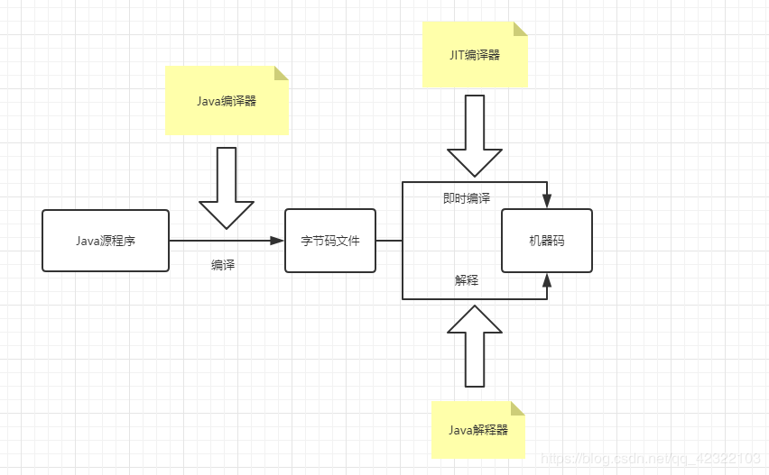

# Java

## 基础

**Day 1**

### 1. Java语言有哪些特点？

- 简单易用
- 面向对象（封装、继承、多态）
- 平台无关性
- 支持多线程
- 支持网络编程
- 可靠且安全
- 编译与解释并存
  - Java源代码首先会被Java编译器编译成字节码文件。然后字节码文件会被Java类加载器加载，再由Java解释器对其进行逐行解释变成机器码。但是由于代码中往往有很多的方法是需要被多次使用的，这个时候逐行解释效率低下，故引入JIT编译器。JIT编译器是一个运行时编译器，可以将第一次编译得到的机器码保存下来，供下次再次使用，从而提高效率。
  - 

### 2. JVM、JDK、JRE分别是什么？
JVM是运行Java字节码的虚拟机，它有针对不同操作系统的特定实现，目的是使用相同的字节码文件，在不同的操作系统下，都能得到相同的运行结果。Java字节码和不同操作系统下的JVM是Java语言实现“一次编写，随处运行”的关键。

JVM只是一种规范，只要符合JVM规范，任何公司、组织或个人都可以编写属于自己的JVM实现。

JDK即Java Development Kit（Java开发工具包）。它是一套完整的Java SDK，拥有JRE的所有功能。还包含了编译器（javac）和其他工具（javadoc、jdb），可以创建和编译java应用程序。

JRE即Java Runtime Environment（Java运行时环境）。它是Java程序运行所需要的所有内容的集合，包括JVM、Java类库、命令和其他的构件，但是不能够创建新的应用程序。

### 3. 什么是字节码？采用字节码的好处是什么？
在Java中，JVM能够理解的代码就叫做字节码（即后缀为.class的文件），字节码不面向任何的处理器，只面向JVM。

采用字节码在一定的程度下解决了传统的解释性语言运行速度慢的问题，同时又保留了解释性语言的可移植性。同时字节码不依赖于机器，所以在不同的环境下，不需要重新编译就能够运行程序。

**Day2**

### 4. 为什么说Java是“编译与解释并存的”？
可以将高级语言按照执行顺序分为以下两种：

**编译型**：源程序在运行之前先一次性将所有代码编译成当前平台可以执行的机器码。编译型语言的运行速度快，但是开发效率低。

**解释型**：解释型语言会通过解释器将源代码一行一行解释成机器码之后再执行。解释型语言的运行速度慢，但开发效率高。

Java语言利用了即时编译技术，综合了编译型和解释型的特点。Java源代码首先被编译器编译成字节码文件，然后再通过解释器将字节码解释成平台能执行的机器码，所以说Java是“编译与解释并存的”。

### 5. Java和C++的区别是什么？

- Java没有指针来直接操作内存，程序内存更加安全。
- Java是单继承的而C++支持多继承，在Java中类是单继承的，而接口支持多继承。
- C++有方法重载和运算符重载，而Java只有方法重载
- Java有自动内存管理垃圾回收机制（GC），程序员无需手动释放内存资源。

**Day 3**

### 6. 字符型常量和字符串常量的区别是什么？

- 字符型常量是用单引号引起来的，而字符串常量是用双引号引起来的
- 字符型常量实际上是一个ASCII码，可以参与表达式运算。字符串常量则是一个地址，指向该串的内存空间
- 在java中，字符型常量占2个字节，字符串常量占若干个字节

### 7. 注释有哪几种形式？

- 单行注释
- 多行注释
- 文档注释

### 8. 标识符和关键字的区别是什么？

在编写代码的时候，经常需要给类、变量、方法等取名字，这些名字就是标识符。

有一些标识符，在java中已经被赋予了特殊的含义，只能用于一些特定的地方，这些标识符就称为关键字。即关键字是被赋予了特殊含义的标识符。